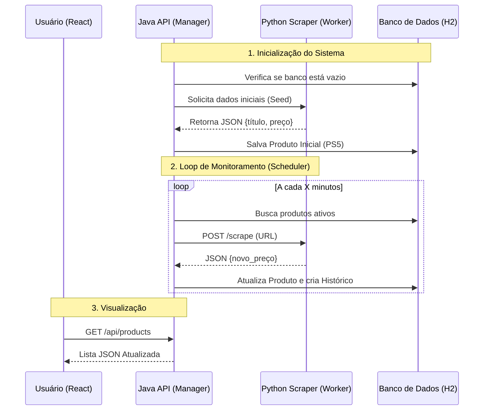

# MarketSpy - Monitor de Preços

> **Sistema distribuído para monitoramento de preços e análise de concorrência em tempo real.**

O **MarketSpy** é uma solução Full Stack desenvolvida para rastrear flutuações de preços. O projeto utiliza uma arquitetura de microserviços onde cada tecnologia é aplicada em sua área de excelência.

--- 

## Arquitetura e Deciões Técnicas

O projeto foi pensado seguindo o princípio de *"Best Tool for the Job"*: 

### Data Extraction Service (Python)

O Python foi escolhido pela sua superioridade em bibliotecas de manipulação de dados e web scraping. Tem como responsabilidade atuar como um microserviço isolado que recebe uma URL, simula um navegador (User-Agent rotation) e extrai metadados (Preço, Título) do HTML bruto. **Tech Stack**: Flask, BeautifulSoup4, Lxml. 

### Core Backend API (Java Spring Boot)

Escolhido para garantir tipagem forte, gerenciamento eficiente de threads para o agendador e facilidade de integração. O Java vai atuar com a **osquestração**, gerenciando quais produtos devem ser monitorados; Com agendamento, com um **`@Scheduler`** interno que verifica periodicamente atualizações de preços. E com **persistência**, mantendo o histórico de preços para análise temporal. **Tech Stack**: Spring Boot 3, Spring Data JPA, H2 Database (File-based), Scheduler.

### Dashboard (React)

React foi escolhido para criar uma interface SPA (Single Page Application) rápida e desaclopada do backend. Consome a API REST do Java e apresenta os dados de forma visual e intuitiva para o usuário final. 

---

## Fluxo de Dados



--- 

## Como Executar 

Como este é um sistema distribuído, vamos precisar de **3 terminais** abertos simultaneamente para rodar o ecossistema completo.

### Pré-requisitos 
- Java 17 ou superior
- Node.js & NPM
- Python 3.8 ou superior

### Passo 1: O Microserviço de Scraping (Python)
No primeiro terminal, vamos subir o serviço responsável pela inteligência de dados:

```
cd marketspy-scraper
python3 -m venv .venv
source .venv/bin/activate
pip install flask requests beautifulsoup4 lxml
python app.py
```

### Passo 2: O Backend (Java)
No segundo terminal, vamos subir a API principal. 
*Nota: ao iniciar, o sistema fará um cadastro automático de um projeto teste (Data Seed).*

```
cd marketspy-api
./mvnw spring-boot:run
```

### Passo 3: O Frontend (React)
No terceiro terminal, vamos subir a interface visual:

```
cd marketspy-web
npm install
npm run dev
```

*Acesse a aplicação em: http://localhost:5173 ou 5174 (confira o terminal).*

---

## Melhorias Futuras

- [ ] Visualização Analítica: implementar gráficos de linha usando `Recchars` para mostrar flutuação do preço ao longo do tempo;
- [ ] Sistema de Alertas: notificar o usuário via E-mail quando o preço atingir um valor alvo; 
- [ ] Containerização: criar um `docker-compose.yml` para orquestrar a subida de todo o ambiente em um único comando;
- [ ] Suporte Multi-Loja: expandir a lógica do scraper Python (Strategy Pattern) para suportar diferentes estruturas HTML. 

--- 

*Projeto desenvolvido para fins de estudo.* 